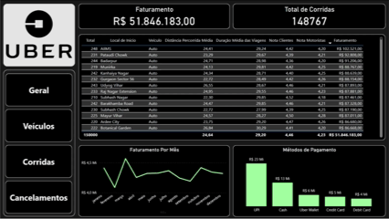

# 🚖 Análise de Corridas da Uber — SQL + Power BI

## 📌 Contexto
Este projeto tem como objetivo analisar dados de corridas da Uber utilizando **consultas SQL** para responder perguntas de negócio 
e consolidar os insights em um **dashboard interativo no Power BI**.

---

## 🔍 Perguntas respondidas com SQL
Principais perguntas respondidas:

1. Qual são os dias com o maior volume de corridas? 
    Resposta: **Segunda, Quarta e Sábado**.
2. Qual é o horário de pico? 
    Resposta: **Entre 17 e 19h.**
3. Qual é a distância média das viagens? 
    Resposta: **24.64km**
4. Quais são os locais de início mais comuns? 
    Resposta: **Khandsa**, 949 corridas 
                **Barakhamba Road**, 946 corridas 
                **Saket**, 931 corridas
5. Qual veículo realizou mais corridas? 
   Resposta: **Automáticos**, 37419 Corridas
6. Qual veículo é mais bem avaliado? 
  Resposta: **Premier Sedan** com uma média de: 4.2368
7. Qual o motivo mais comum de cancelamento pelos clientes? 
  Resposta: **Endereço Errado**, 2362 Vezes
8. Qual o motivo mais comum de cancelamento pelo motorista? 
  Resposta: **Problema com o cliente**, 6837 Vezes
9. Qual o tempo médio de espera e de viagem? 
  Resposta: Tempo médio de espera: **8 minutos** 
  Tempo médio de viagens: **29 minutos**.

➡️ *Todas as queries estão documentadas no notebook [`Sql_Query.ipynb`](Sql_Query.ipynb).*

---

## 📊 Dashboard em Power BI
Os resultados foram consolidados e separados em um dashboard no Power BI por meio de diferentes categorias acessadas pelo uso de um menu seletor que inclui as seções:
- Geral
- Veículos
- Corridas
- Cancelamentos

📄 Veja o dashboard completo em [`Dashboard.pdf`](Dashboard.pdf).

Exemplo de visualização:

  
---

## ⚙️ Tecnologias Utilizadas
- **SQL (MySQL)** → consultas e agregações  
- **Python (Jupyter Notebook)** → execução e organização das queries  
- **Power BI** → visualização e storytelling dos dados  
- **Excel/CSV** → dataset base  

---

## 💡 Principais Insights
- Os dias com o maior número de corridas são Segunda, Quarta e Sábado.
- A maior concentração de corridas ocorre nos horários entre 17 e 19 horas.  
- Os veículos que obtiveram mais corridas foram os automáticos e os que obtiveram menos foram os Uber XL.
- As corridas com as maiores distâncias se concentram nos meses de junho e julho, possivelmente relacionado a férias.
- Os meses de Janeiro, Maio e Julho possuem uma maior taxa de cancelamento.  

---
